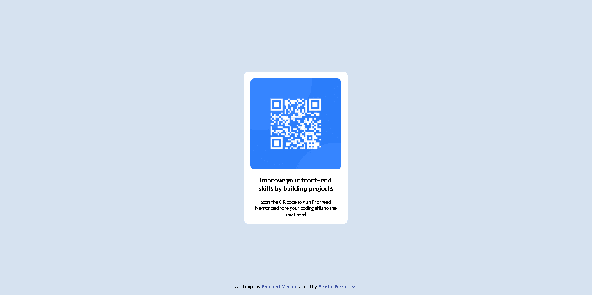

# Frontend Mentor - QR code component solution

This is a solution to the [QR code component challenge on Frontend Mentor](https://www.frontendmentor.io/challenges/qr-code-component-iux_sIO_H). Frontend Mentor challenges help you improve your coding skills by building realistic projects. 

## Table of contents

- [Overview](#overview)
  - [Screenshot](#screenshot)
  - [Links](#links)
- [My process](#my-process)
  - [Built with](#built-with)
  - [What I learned](#what-i-learned)
  - [Continued development](#continued-development)
  - [Useful resources](#useful-resources)
- [Author](#author)
- [Acknowledgments](#acknowledgments)

**Note: Delete this note and update the table of contents based on what sections you keep.**

## Overview

### Screenshot

### Links

- Solution URL: [Add solution URL here](https://github.com/AgusCFx/Frontend-Mentor/tree/main/QR-code-component)
- Live Site URL: [incoming...]()

## My process

### Built with

- Semantic HTML5 markup
- CSS custom properties
- Flexbox

### Continued development

El uso de clases de estilo las cuales en la hoja [style.css](style.css) comenté como Style ultility desconozco si puede ser mala practica, pero aprendí que eso ahorra codigo, y el hecho de hacer codigo reutilizable es buena practica. Es como crear una mini-libreria.

## Author

- Website - [Incoming...]()
- Frontend Mentor - [@AgusCFx](https://www.frontendmentor.io/profile/AgusCFx)